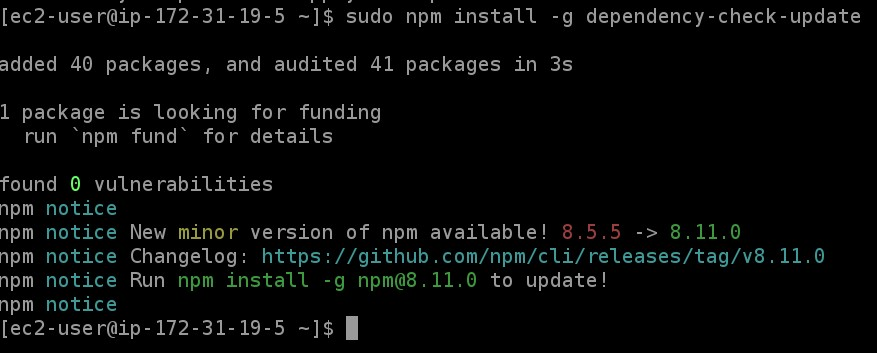
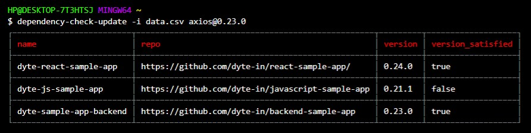
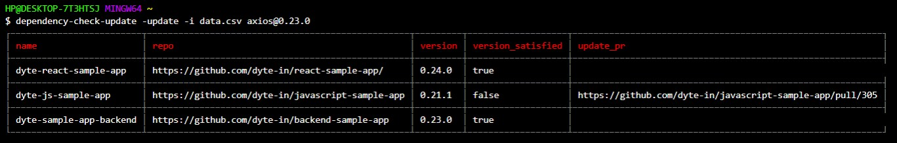
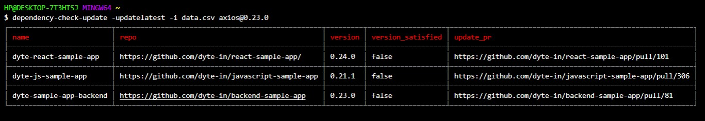

[](https://classroom.github.com/online_ide?assignment_repo_id=7942987&assignment_repo_type=AssignmentRepo)
<div id="top"></div>
<!--
*** Thanks for checking out the Best-README-Template. If you have a suggestion
*** that would make this better, please fork the repo and create a pull request
*** or simply open an issue with the tag "enhancement".
*** Don't forget to give the project a star!
*** Thanks again! Now go create something AMAZING! :D
-->


<!-- PROJECT SHIELDS -->
<!--
*** I'm using markdown "reference style" links for readability.
*** Reference links are enclosed in brackets [ ] instead of parentheses ( ).
*** See the bottom of this document for the declaration of the reference variables
*** for contributors-url, forks-url, etc. This is an optional, concise syntax you may use.
*** https://www.markdownguide.org/basic-syntax/#reference-style-links
-->


<!-- PROJECT LOGO -->
<br />
<div align="center">
  <a href="https://github.com/dyte-submissions/dyte-vit-2022-tanish-malekar">
    
  </a>

<h3 align="center">dependency-check-update</h3>

  <p align="center">
    dependency-check-update is a CLI tool that checks the dependancies and their versions of a Node.js project and updates them if required
    <br />
    <a href="https://github.com/dyte-submissions/dyte-vit-2022-tanish-malekar"><strong>Explore the docs »</strong></a>
    <br />
    <br />
    <a href="https://github.com/dyte-submissions/dyte-vit-2022-tanish-malekar">View Demo</a>
    ·
    <a href="https://github.com/dyte-submissions/dyte-vit-2022-tanish-malekar/issues">Report Bug</a>
    ·
    <a href="https://github.com/dyte-submissions/dyte-vit-2022-tanish-malekar/issues">Request Feature</a>
  </p>
</div>


<!-- TABLE OF CONTENTS -->
<details>
  <summary>Table of Contents</summary>
  <ol>
    <li>
      <a href="#about-the-project">About The Project</a>
      <ul>
        <li><a href="#built-with">Built With</a></li>
      </ul>
    </li>
    <li>
      <a href="#getting-started">Getting Started</a>
    </li>
    <li><a href="#usage">Usage</a></li>
    <li><a href="#contributing">Contributing</a></li>
    <li><a href="#license">License</a></li>
    <li><a href="#contact">Contact</a></li>
    <li><a href="#acknowledgments">Acknowledgments</a></li>
  </ol>
</details>


<!-- ABOUT THE PROJECT -->
## About The Project

Applications written in Node.js have multiple dependencies and making sure that these dependencies are up to date can be a bit of a hassle.<br />
dependency-check-update is a CLI tool which helps in comparing the versions of a given package in given github repositories against a specified version and returning whether the versions are satisfied or not. If not satisfied, the tool can also create Pull Requests updating the versions to the given version. <br/><br/><b><ins>Additional Feature: An option to update the versions of the given package to the latest version available in npm resgistry is also provided.</ins></b><br><br>
The names and links to the input github repositories are given to the tool in the form of a csv file. A sample csv file named "data.csv" with test data can be found in the root of this repository. 


<p align="right">(<a href="#top">back to top</a>)</p>


### Built With

* [Node.js](https://nodejs.org/)

<p align="right">(<a href="#top">back to top</a>)</p>


<!-- GETTING STARTED -->
## Getting Started

To install the tool, run the following command:
  ```sh
  npm install -g dependency-check-update
  ```
Example:<br>



<p align="right">(<a href="#top">back to top</a>)</p>


<!-- USAGE EXAMPLES -->
## Usage
<b>IMPORTANT: Make sure the CSV file is present in the current working directory of the terminal. If not, cd into the folder where the file is present. A sample CSV file named data.csv is given in this repo for testing purposes.</b>

The CLI tool has the following 3 features:
1. <ins>Check versions:</ins> Given a list of Github repositories in the form of a csv file (the csv file should have 2 columns: name and repo), such that all of them are node js projects with a package.json and package-lock.json in the root, and the name and version of a dependency, the tool gives the current version of that dependency and tells if the version is greater than or equal to the version specified or not.
2. <ins>Update versions:</ins> For all the repositories that have the version lower than the one specified, if passed as additional param, -update, it will create a Pull Request updating the version.  
3. <ins>Update versions to the latest one (additional feature):</ins>  Updates the versions of the specified package to the latest version available in npm resgistry by creating PRs.

Let's look at examples of each of these features:

1. <ins>Check versions:</ins>

Syntax:
```sh
dependency-check-update -i <CsvFileName> <PackageName@InputVersion>
```
Example:
```sh
dependency-check-update -i data.csv axios@0.23.0
```
 

2. <ins>Update versions:</ins>

Syntax:
```sh
dependency-check-update -update -i <CsvFileName> <PackageName@InputVersion>
```
Example:
```sh
dependency-check-update -update -i data.csv axios@0.23.0
```


3. <ins>Update versions to the latest one (additional feature):</ins>
 
Syntax:
```sh
dependency-check-update -updatelatest -i <CsvFileName> <PackageName>
```
Example:
```sh
dependency-check-update -updatelatest -i data.csv axios
```


<p align="right">(<a href="#top">back to top</a>)</p>


<!-- CONTRIBUTING -->
## Contributing

Contributions are what make the open source community such an amazing place to learn, inspire, and create. Any contributions you make are **greatly appreciated**.

If you have a suggestion that would make this better, please fork the repo and create a pull request. You can also simply open an issue with the tag "enhancement".
Don't forget to give the project a star! Thanks again!

1. Fork the Project
2. Create your Feature Branch (`git checkout -b feature/AmazingFeature`)
3. Commit your Changes (`git commit -m 'Add some AmazingFeature'`)
4. Push to the Branch (`git push origin feature/AmazingFeature`)
5. Open a Pull Request

<p align="right">(<a href="#top">back to top</a>)</p>


<!-- LICENSE -->
## License

Distributed under the MIT License. See `LICENSE.txt` for more information.

<p align="right">(<a href="#top">back to top</a>)</p>


<!-- CONTACT -->
## Contact

Tanish Malekar - [LinkedIn](https://www.linkedin.com/in/tanish-malekar/) - tanishmalekar32@gmail.com

Project Link: [https://github.com/dyte-submissions/dyte-vit-2022-tanish-malekar](https://github.com/dyte-submissions/dyte-vit-2022-tanish-malekar)

<p align="right">(<a href="#top">back to top</a>)</p>


<!-- ACKNOWLEDGMENTS -->
## Acknowledgments

I would like to thank Dyte for providing this oppurtunity to create a CLI tool as a part of their hiring challenge. I learnt a lot in the process. 

<p align="right">(<a href="#top">back to top</a>)</p>


<!-- MARKDOWN LINKS & IMAGES -->
<!-- https://www.markdownguide.org/basic-syntax/#reference-style-links -->
[contributors-shield]: https://img.shields.io/github/contributors/dyte-submissions/dyte-vit-2022-tanish-malekar.svg?style=for-the-badge
[contributors-url]: https://github.com/dyte-submissions/dyte-vit-2022-tanish-malekar/graphs/contributors
[forks-shield]: https://img.shields.io/github/forks/dyte-submissions/dyte-vit-2022-tanish-malekar.svg?style=for-the-badge
[forks-url]: https://github.com/dyte-submissions/dyte-vit-2022-tanish-malekar/network/members
[stars-shield]: https://img.shields.io/github/stars/dyte-submissions/dyte-vit-2022-tanish-malekar.svg?style=for-the-badge
[stars-url]: https://github.com/dyte-submissions/dyte-vit-2022-tanish-malekar/stargazers
[issues-shield]: https://img.shields.io/github/issues/dyte-submissions/dyte-vit-2022-tanish-malekar.svg?style=for-the-badge
[issues-url]: https://github.com/dyte-submissions/dyte-vit-2022-tanish-malekar/issues
[license-shield]: https://img.shields.io/github/license/dyte-submissions/dyte-vit-2022-tanish-malekar.svg?style=for-the-badge
[license-url]: https://github.com/dyte-submissions/dyte-vit-2022-tanish-malekar/blob/master/LICENSE.txt
[linkedin-shield]: https://img.shields.io/badge/-LinkedIn-black.svg?style=for-the-badge&logo=linkedin&colorB=555
[linkedin-url]: https://linkedin.com/in/tanish-malekar
[product-screenshot]: images/screenshot.png
